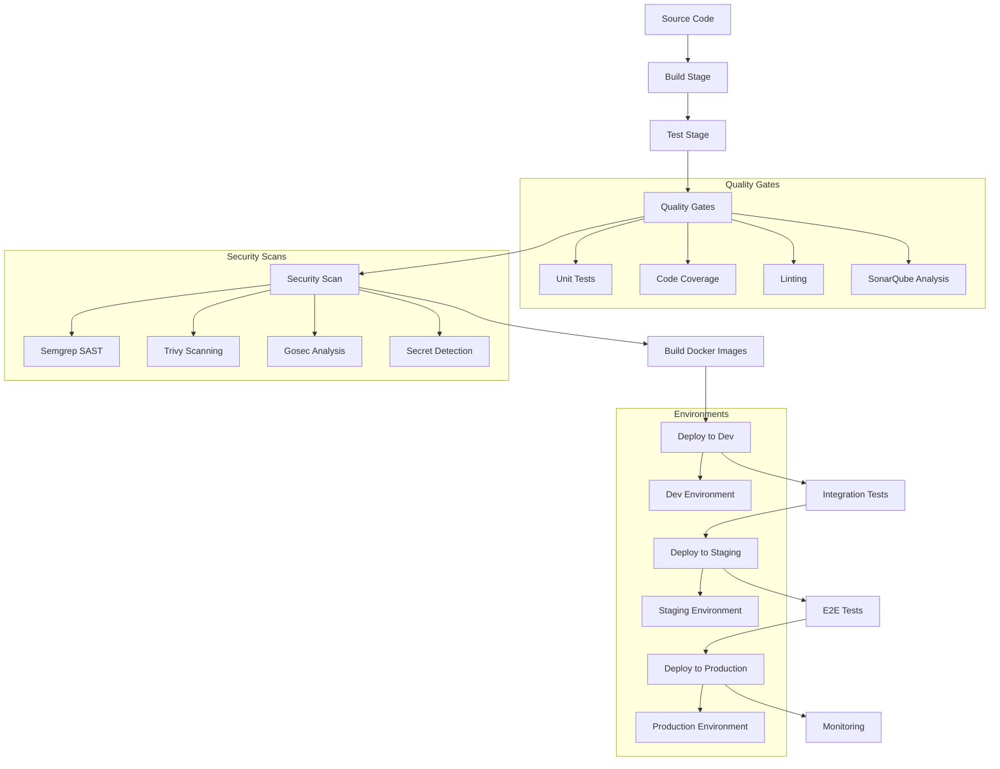

# CI/CD Pipeline Documentation

## Overview

This document describes the CI/CD pipeline architecture for the APM (Application Performance Monitoring) stack. The pipeline supports automated testing, building, and deployment of the APM components including Prometheus, Grafana, Jaeger, Loki, and associated applications.

## Pipeline Architecture



## Pipeline Stages

### 1. Source Code Stage
- **Trigger**: Git push to main branch or pull request
- **Actions**:
  - Checkout source code
  - Set up Go environment
  - Cache dependencies
- **Outputs**: Source code ready for build

### 2. Build Stage
- **Duration**: ~2-3 minutes
- **Actions**:
  - Run `make build-app` to compile Go application
  - Validate configuration files
  - Generate build artifacts
- **Artifacts**: Binary executables, configuration files
- **Failure Conditions**: Compilation errors, missing dependencies

### 3. Test Stage
- **Duration**: ~3-5 minutes
- **Actions**:
  - Run unit tests: `make test`
  - Generate test coverage: `make test-coverage`
  - Run integration tests
- **Coverage Requirements**: Minimum 80% code coverage
- **Failure Conditions**: Test failures, coverage below threshold

### 4. Quality Gates Stage
- **Duration**: ~2-4 minutes
- **Actions**:
  - Static code analysis (SonarQube)
  - Security vulnerability scanning
  - Code quality metrics validation
  - Dependency vulnerability check
- **Requirements**: See [Quality Gates Documentation](quality-gates.md)

### 5. Security Scan Stage
- **Duration**: ~2-3 minutes
- **Actions**:
  - Static application security testing (Semgrep)
  - Container image scanning (Trivy)
  - Go security analysis (Gosec)
  - Dependency vulnerability assessment
  - Secret detection
  - License compliance check
- **Tools**:
  - **Semgrep**: Custom security rules for Go and GoFiber
  - **Trivy**: Container and filesystem vulnerability scanning
  - **Gosec**: Go-specific security analysis
  - **Govulncheck**: Go vulnerability database checks
- **Failure Conditions**: Critical vulnerabilities, hardcoded secrets, license violations
- **Documentation**: [Semgrep Security Guide](security/semgrep.md)

### 6. Build Docker Images Stage
- **Duration**: ~3-5 minutes
- **Actions**:
  - Build application Docker image
  - Tag with commit SHA and version
  - Push to container registry
  - Generate SBOM (Software Bill of Materials)
- **Outputs**: Docker images in registry

### 7. Deploy to Dev Stage
- **Duration**: ~2-3 minutes
- **Target**: Development environment
- **Actions**:
  - Deploy to Kubernetes cluster
  - Run smoke tests
  - Validate service health
- **Rollback**: Automatic on failure

### 8. Integration Tests Stage
- **Duration**: ~5-10 minutes
- **Actions**:
  - API integration tests
  - Service mesh connectivity tests
  - Observability stack validation
  - Performance baseline tests
- **Requirements**: All services responding, metrics collecting

### 9. Deploy to Staging Stage
- **Duration**: ~3-5 minutes
- **Target**: Staging environment
- **Requirements**: Dev deployment successful
- **Actions**:
  - Blue-green deployment
  - Database migration (if applicable)
  - Configuration updates
- **Validation**: Health checks, monitoring alerts

### 10. E2E Tests Stage
- **Duration**: ~10-15 minutes
- **Actions**:
  - End-to-end user journey tests
  - Load testing
  - Chaos engineering tests
  - Monitoring and alerting validation
- **Requirements**: All critical paths working

### 11. Deploy to Production Stage
- **Duration**: ~5-10 minutes
- **Target**: Production environment
- **Requirements**: Manual approval + staging success
- **Actions**:
  - Canary deployment (10% traffic)
  - Gradual traffic increase
  - Full deployment
  - Post-deployment validation
- **Monitoring**: Real-time metrics, error rates

### 12. Monitoring Stage
- **Duration**: Continuous
- **Actions**:
  - Application performance monitoring
  - Infrastructure monitoring
  - Alert generation
  - SLO/SLI tracking
- **Tools**: Prometheus, Grafana, Jaeger, Loki

## Environment Promotion

### Development Environment
- **Purpose**: Feature development and initial testing
- **Deployment**: Automatic on merge to main
- **Configuration**: 
  - Relaxed security policies
  - Debug logging enabled
  - Extended timeouts
- **Data**: Synthetic test data
- **Monitoring**: Basic metrics collection

### Staging Environment
- **Purpose**: Production-like testing and validation
- **Deployment**: Automatic after dev validation
- **Configuration**: 
  - Production-like security policies
  - Production logging levels
  - Production timeouts
- **Data**: Anonymized production data
- **Monitoring**: Full observability stack

### Production Environment
- **Purpose**: Live user traffic
- **Deployment**: Manual approval required
- **Configuration**: 
  - Strict security policies
  - Optimized performance settings
  - Production secrets
- **Data**: Live production data
- **Monitoring**: Full observability + alerting

## Rollback Procedures

### Automated Rollback Triggers
- **Health Check Failures**: Service not responding after 5 minutes
- **Error Rate Spike**: >5% error rate for 2 minutes
- **Performance Degradation**: >50% increase in response time
- **Resource Exhaustion**: CPU/Memory >90% for 3 minutes

### Manual Rollback Process

#### 1. Immediate Rollback (< 5 minutes)
```bash
# For Kubernetes deployments
kubectl rollout undo deployment/apm-app -n production

# For Docker Compose
docker-compose down
docker-compose up -d --scale app=0  # Stop current
docker tag apm-app:previous apm-app:current
docker-compose up -d
```

#### 2. Database Rollback (if applicable)
```bash
# Check for database migrations
kubectl get migrations -n production

# Rollback database schema
kubectl apply -f rollback-migration.yaml
```

#### 3. Configuration Rollback
```bash
# Restore previous configuration
kubectl apply -f configs/previous/
kubectl rollout restart deployment/apm-app
```

#### 4. Verification Steps
1. Check service health endpoints
2. Verify error rates in Grafana
3. Validate critical user journeys
4. Monitor for 15 minutes

### Rollback Decision Matrix

| Scenario | Rollback Type | Time to Execute | Approval Required |
|----------|---------------|-----------------|-------------------|
| Critical bug affecting users | Immediate | < 5 minutes | No |
| Performance degradation | Immediate | < 5 minutes | No |
| Security vulnerability | Immediate | < 5 minutes | No |
| Non-critical feature issue | Scheduled | < 30 minutes | Yes |
| Database schema issues | Coordinated | < 1 hour | Yes |

## Pipeline Configuration

### Environment Variables
```yaml
# Build configuration
GO_VERSION: "1.21"
DOCKER_REGISTRY: "your-registry.com"
IMAGE_TAG: "${COMMIT_SHA}"

# Quality gates
MIN_COVERAGE: "80"
MAX_COMPLEXITY: "15"
SONAR_PROJECT_KEY: "apm-stack"

# Deployment configuration
KUBE_NAMESPACE: "apm-system"
HELM_CHART_VERSION: "1.0.0"
```

### Pipeline Triggers
- **Push to main**: Full pipeline
- **Pull request**: Build + test + quality gates
- **Tag push**: Release pipeline
- **Scheduled**: Nightly security scans

### Branch Protection Rules
- **main branch**: 
  - Require PR reviews (2 approvals)
  - Require status checks
  - Require up-to-date branch
  - Restrict push access

## Monitoring and Alerting

### Pipeline Metrics
- **Build Duration**: Target < 10 minutes
- **Test Success Rate**: Target > 99%
- **Deployment Frequency**: Daily
- **Lead Time**: Target < 2 hours
- **MTTR**: Target < 30 minutes

### Alert Configuration
```yaml
# Pipeline failure alert
- alert: PipelineFailure
  expr: pipeline_status != 0
  for: 0m
  labels:
    severity: critical
  annotations:
    summary: "CI/CD pipeline failed"
    description: "Pipeline {{ $labels.pipeline }} failed at stage {{ $labels.stage }}"

# Deployment alert
- alert: DeploymentFailed
  expr: deployment_status != 0
  for: 5m
  labels:
    severity: critical
  annotations:
    summary: "Deployment failed"
    description: "Deployment to {{ $labels.environment }} failed"
```

## Best Practices

### Code Quality
- Write comprehensive unit tests
- Use consistent code formatting
- Implement proper error handling
- Document API changes

### Security
- Never commit secrets to source code
- Use security scanning tools
- Implement least-privilege access
- Regular dependency updates

### Deployment
- Use infrastructure as code
- Implement blue-green deployments
- Test rollback procedures regularly
- Monitor deployment metrics

### Monitoring
- Set up comprehensive logging
- Configure meaningful alerts
- Monitor business metrics
- Implement distributed tracing

## Troubleshooting

### Common Issues

#### 1. Build Failures
```bash
# Check build logs
kubectl logs -f job/build-job

# Common causes:
# - Missing dependencies
# - Compilation errors
# - Resource constraints
```

#### 2. Test Failures
```bash
# Run tests locally
make test-verbose

# Check coverage
make test-coverage

# Debug specific test
go test -v ./pkg/service -run TestSpecificFunction
```

#### 3. Deployment Issues
```bash
# Check deployment status
kubectl get deployments -n apm-system

# View deployment logs
kubectl logs -f deployment/apm-app -n apm-system

# Check resource usage
kubectl top pods -n apm-system
```

#### 4. Quality Gate Failures
```bash
# Check SonarQube results
curl -u admin:admin http://sonarqube:9000/api/qualitygates/project_status?projectKey=apm-stack

# Review code coverage
go tool cover -html=coverage.out
```

## Related Documentation
- [Quality Gates Documentation](quality-gates.md)
- [CI Configuration](../ci/README.md)
- [Scripts Documentation](../scripts/README.md)
- [Runbooks](runbooks/)