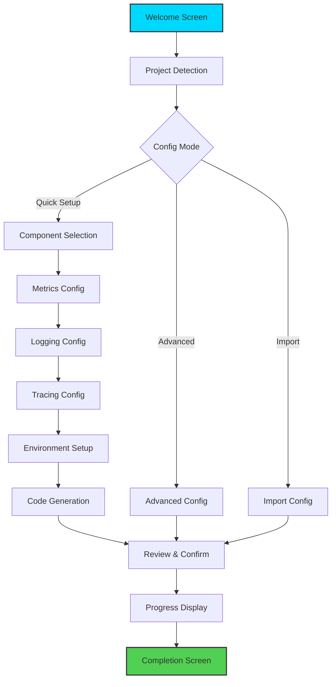

# APM Init Wizard - Interactive Flow Mockups

## Overview
This document provides detailed mockups and implementation specifications for the `apm init` interactive wizard using Bubble Tea framework.

## Color Scheme & Styling

```go
// Color definitions
const (
    ColorPrimary   = "#00D9FF" // Cyan - Headers, selections
    ColorSuccess   = "#52D053" // Green - Success states
    ColorWarning   = "#FFB454" // Orange - Warnings
    ColorError     = "#FF6B6B" // Red - Errors
    ColorInfo      = "#4ECDC4" // Teal - Info messages
    ColorMuted     = "#626262" // Gray - Inactive items
    ColorAccent    = "#FFE66D" // Yellow - Highlights
)
```

## Screen Flow Diagram



## Detailed Screen Mockups

### 1. Welcome Screen (Animated)

```
╭─────────────────────────────────────────────────────────────────╮
│                                                                 │
│                    ╱╱╱╱╱╱╱╱╱╱╱╱╱╱╱╱╱╱╱╱╱╱╱                     │
│                   ╱                         ╱                    │
│                  ╱   APM Configuration     ╱                    │
│                 ╱         Wizard          ╱                     │
│                ╱╱╱╱╱╱╱╱╱╱╱╱╱╱╱╱╱╱╱╱╱╱╱╱╱                      │
│                                                                 │
│              Welcome to the APM setup wizard!                   │
│                                                                 │
│         This wizard will help you configure:                    │
│          • Metrics collection (Prometheus)                      │
│          • Distributed tracing (OpenTelemetry)                  │
│          • Structured logging                                   │
│          • Health monitoring                                    │
│                                                                 │
│                  Press Enter to begin →                         │
│                                                                 │
│                     [ Ctrl+C to exit ]                          │
│                                                                 │
╰─────────────────────────────────────────────────────────────────╯
```

### 2. Project Detection (With Spinner)

```
╭─────────────────────────────────────────────────────────────────╮
│ 📁 Project Configuration                              [Step 1/9] │
├─────────────────────────────────────────────────────────────────┤
│                                                                 │
│  ⠋ Scanning project structure...                                │
│                                                                 │
│  ✓ Found go.mod file                                           │
│  ✓ Detected GoFiber v2.52.0                                    │
│  ✓ Go version 1.23.0 compatible                                │
│                                                                 │
│  Project Details:                                               │
│  ┌─────────────────────────────────────────────────┐          │
│  │ Module:  github.com/chaksack/apm                │          │
│  │ Path:    /Users/ybke/GolandProjects/apm         │          │
│  │ Type:    GoFiber Application                     │          │
│  └─────────────────────────────────────────────────┘          │
│                                                                 │
│  Is this information correct?                                   │
│                                                                 │
│         [ Yes, continue ]    [ No, configure manually ]         │
│                  ▔▔▔▔▔▔▔▔▔▔▔▔▔                                  │
│                                                                 │
╰─────────────────────────────────────────────────────────────────╯
```

### 3. Configuration Mode (Animated Selection)

```
╭─────────────────────────────────────────────────────────────────╮
│ ⚙️  Configuration Mode                                [Step 2/9] │
├─────────────────────────────────────────────────────────────────┤
│                                                                 │
│  How would you like to configure your APM setup?               │
│                                                                 │
│  ┌─────────────────────────────────────────────────┐          │
│  │                                                   │          │
│  │  ▶ 🚀 Quick Setup (Recommended)                  │          │
│  │     Get started with sensible defaults           │          │
│  │     Perfect for most applications                │          │
│  │                                                   │          │
│  │    🔧 Advanced Configuration                      │          │
│  │     Fine-tune every aspect of APM                │          │
│  │     For experienced users                        │          │
│  │                                                   │          │
│  │    📥 Import Existing Configuration              │          │
│  │     Use configuration from another project       │          │
│  │     Supports YAML, JSON, TOML                    │          │
│  │                                                   │          │
│  └─────────────────────────────────────────────────┘          │
│                                                                 │
│  Use ↑↓ to navigate, Enter to select                           │
│                                                                 │
╰─────────────────────────────────────────────────────────────────╯
```

### 4. Component Selection (Interactive Checklist)

```
╭─────────────────────────────────────────────────────────────────╮
│ 📦 Component Selection                               [Step 3/9] │
├─────────────────────────────────────────────────────────────────┤
│                                                                 │
│  Select the APM components you want to enable:                 │
│                                                                 │
│  ┌─────────────────────────────────────────────────┐          │
│  │                                                   │          │
│  │  [✓] Metrics (Prometheus)              ESSENTIAL │          │
│  │      └─ HTTP metrics, custom counters            │          │
│  │                                                   │          │
│  │  [✓] Logging (Structured JSON)        ESSENTIAL │          │
│  │      └─ Request logs, error tracking             │          │
│  │                                                   │          │
│  │  [✓] Tracing (OpenTelemetry)         RECOMMENDED│          │
│  │      └─ Distributed request tracing              │          │
│  │                                                   │          │
│  │  [ ] Profiling (pprof)                 OPTIONAL │          │
│  │      └─ CPU and memory profiling                 │          │
│  │                                                   │          │
│  │  [✓] Health Checks                   RECOMMENDED│          │
│  │      └─ Liveness and readiness probes            │          │
│  │                                                   │          │
│  └─────────────────────────────────────────────────┘          │
│                                                                 │
│  Space to toggle • Tab to navigate • Enter to continue         │
│                                                                 │
│                            3 of 5 selected                      │
│                                                                 │
╰─────────────────────────────────────────────────────────────────╯
```

### 5. Metrics Configuration (Form with Validation)

```
╭─────────────────────────────────────────────────────────────────╮
│ 📊 Metrics Configuration                             [Step 4/9] │
├─────────────────────────────────────────────────────────────────┤
│                                                                 │
│  Configure Prometheus metrics collection:                       │
│                                                                 │
│  Metrics Port:                                                  │
│  ┌─────────────────────────────────────────────────┐          │
│  │ 9090                                             │          │
│  └─────────────────────────────────────────────────┘          │
│  ✓ Port is available                                           │
│                                                                 │
│  Metrics Path:                                                  │
│  ┌─────────────────────────────────────────────────┐          │
│  │ /metrics                                         │          │
│  └─────────────────────────────────────────────────┘          │
│                                                                 │
│  Additional Options:                                            │
│  ┌─────────────────────────────────────────────────┐          │
│  │ [ ] Enable custom business metrics               │          │
│  │ [✓] Enable Go runtime metrics                    │          │
│  │ [ ] Enable database pool metrics                 │          │
│  │ [✓] Enable HTTP route grouping                   │          │
│  └─────────────────────────────────────────────────┘          │
│                                                                 │
│  Tab/Shift+Tab to navigate • Enter to continue                 │
│                                                                 │
╰─────────────────────────────────────────────────────────────────╯
```

### 6. Logging Configuration (Radio Groups)

```
╭─────────────────────────────────────────────────────────────────╮
│ 📝 Logging Configuration                             [Step 5/9] │
├─────────────────────────────────────────────────────────────────┤
│                                                                 │
│  Configure structured logging:                                  │
│                                                                 │
│  Log Level:                                                     │
│  ┌─────────────────────────────────────────────────┐          │
│  │ ○ Debug    ○ Info    ● Warn    ○ Error         │          │
│  └─────────────────────────────────────────────────┘          │
│                                                                 │
│  Log Format:                                                    │
│  ┌─────────────────────────────────────────────────┐          │
│  │ ● JSON     ○ Logfmt  ○ Console                 │          │
│  └─────────────────────────────────────────────────┘          │
│  Example: {"level":"info","msg":"Request processed"}           │
│                                                                 │
│  Output:                                                        │
│  ┌─────────────────────────────────────────────────┐          │
│  │ ○ Console only                                   │          │
│  │ ● Console + File                                 │          │
│  │ ○ File only                                      │          │
│  └─────────────────────────────────────────────────┘          │
│                                                                 │
│  Log File Path: (if file output selected)                      │
│  ┌─────────────────────────────────────────────────┐          │
│  │ logs/app.log                                     │          │
│  └─────────────────────────────────────────────────┘          │
│                                                                 │
╰─────────────────────────────────────────────────────────────────╯
```

### 7. Tracing Configuration (Dynamic Fields)

```
╭─────────────────────────────────────────────────────────────────╮
│ 🔍 Tracing Configuration                             [Step 6/9] │
├─────────────────────────────────────────────────────────────────┤
│                                                                 │
│  Configure distributed tracing:                                 │
│                                                                 │
│  Tracing Backend:                                               │
│  ┌─────────────────────────────────────────────────┐          │
│  │ ● Jaeger   ○ Zipkin   ○ OTLP   ○ Console      │          │
│  └─────────────────────────────────────────────────┘          │
│                                                                 │
│  Jaeger Configuration:                                          │
│  ┌─────────────────────────────────────────────────┐          │
│  │ Agent Host: localhost                            │          │
│  │ Agent Port: 6831                                 │          │
│  │ ✓ Connection verified                            │          │
│  └─────────────────────────────────────────────────┘          │
│                                                                 │
│  Sampling Strategy:                                             │
│  ┌─────────────────────────────────────────────────┐          │
│  │ ○ Always Sample (100%)                           │          │
│  │ ● Probabilistic                                  │          │
│  │ ○ Rate Limited                                   │          │
│  └─────────────────────────────────────────────────┘          │
│                                                                 │
│  Sample Rate: ████████░░░░░░░░░░░░ 0.1 (10%)                  │
│  Drag to adjust or type value                                  │
│                                                                 │
│  ⚠️  Low sample rate - consider increasing for dev              │
│                                                                 │
╰─────────────────────────────────────────────────────────────────╯
```

### 8. Environment Configuration (Multi-Select)

```
╭─────────────────────────────────────────────────────────────────╮
│ 🌍 Environment Configuration                         [Step 7/9] │
├─────────────────────────────────────────────────────────────────┤
│                                                                 │
│  Select environments to configure:                              │
│                                                                 │
│  ┌─────────────────────────────────────────────────┐          │
│  │                                                   │          │
│  │  [✓] Development                                 │          │
│  │      └─ Local development settings              │          │
│  │      └─ Verbose logging, 100% sampling          │          │
│  │                                                   │          │
│  │  [✓] Staging                                     │          │
│  │      └─ Pre-production environment              │          │
│  │      └─ Moderate logging, 10% sampling          │          │
│  │                                                   │          │
│  │  [✓] Production                                  │          │
│  │      └─ Live environment                        │          │
│  │      └─ Error logging only, 1% sampling         │          │
│  │                                                   │          │
│  │  [ ] Custom: ________________                    │          │
│  │                                                   │          │
│  └─────────────────────────────────────────────────┘          │
│                                                                 │
│  Each environment will have its own configuration file         │
│  Base config: config/apm.yaml                                  │
│  Overrides:   config/apm.{env}.yaml                           │
│                                                                 │
╰─────────────────────────────────────────────────────────────────╯
```

### 9. Code Generation Options

```
╭─────────────────────────────────────────────────────────────────╮
│ 🔧 Code Generation                                   [Step 8/9] │
├─────────────────────────────────────────────────────────────────┤
│                                                                 │
│  Select what to generate:                                       │
│                                                                 │
│  ┌─────────────────────────────────────────────────┐          │
│  │                                                   │          │
│  │  [✓] Middleware Integration                      │          │
│  │      └─ internal/apm/middleware.go              │          │
│  │      └─ Ready-to-use GoFiber middleware         │          │
│  │                                                   │          │
│  │  [✓] Example Endpoints                           │          │
│  │      └─ examples/instrumented_api.go            │          │
│  │      └─ Shows best practices                    │          │
│  │                                                   │          │
│  │  [✓] Docker Compose Stack                        │          │
│  │      └─ docker-compose.apm.yml                  │          │
│  │      └─ Complete APM stack for testing          │          │
│  │                                                   │          │
│  │  [ ] Kubernetes Manifests                        │          │
│  │      └─ k8s/apm-stack/                          │          │
│  │      └─ Production-ready deployments            │          │
│  │                                                   │          │
│  │  [✓] Grafana Dashboards                          │          │
│  │      └─ dashboards/gofiber-app.json             │          │
│  │      └─ Pre-configured metrics views            │          │
│  │                                                   │          │
│  └─────────────────────────────────────────────────┘          │
│                                                                 │
╰─────────────────────────────────────────────────────────────────╯
```

### 10. Review & Confirm (Scrollable Summary)

```
╭─────────────────────────────────────────────────────────────────╮
│ 📋 Configuration Summary                             [Step 9/9] │
├─────────────────────────────────────────────────────────────────┤
│                                                                 │
│  Review your configuration:                          ▲          │
│                                                      █          │
│  COMPONENTS                                          █          │
│  ═══════════                                         █          │
│  ✓ Metrics (Prometheus)                              █          │
│    • Port: 9090, Path: /metrics                     █          │
│    • Runtime metrics enabled                         ░          │
│                                                      ░          │
│  ✓ Logging (Structured JSON)                         ░          │
│    • Level: WARN                                     ░          │
│    • Output: Console + File (logs/app.log)          ░          │
│                                                      ░          │
│  ✓ Tracing (Jaeger)                                 ░          │
│    • Endpoint: localhost:6831                        ▼          │
│    • Sampling: 10% probabilistic                               │
│                                                                 │
│  Press ↓ to see more...                                        │
│                                                                 │
│  ┌──────────────┬───────────────┬────────────────┐            │
│  │   Generate   │     Back      │     Cancel     │            │
│  └──────────────┴───────────────┴────────────────┘            │
│         ▔▔▔▔▔▔▔▔▔▔▔▔▔▔                                         │
│                                                                 │
╰─────────────────────────────────────────────────────────────────╯
```

### 11. Progress Display (Real-time Updates)

```
╭─────────────────────────────────────────────────────────────────╮
│ 🚀 Generating APM Configuration                                 │
├─────────────────────────────────────────────────────────────────┤
│                                                                 │
│  Creating configuration files...                                │
│                                                                 │
│  ✓ Created config/apm.yaml                         [0.2s]      │
│  ✓ Created config/apm.dev.yaml                     [0.1s]      │
│  ✓ Created config/apm.staging.yaml                 [0.1s]      │
│  ✓ Created config/apm.prod.yaml                    [0.1s]      │
│                                                                 │
│  ✓ Generated internal/apm/middleware.go            [0.3s]      │
│  ✓ Generated examples/instrumented_api.go          [0.2s]      │
│                                                                 │
│  ⠙ Creating docker-compose.apm.yml...                          │
│  ○ Setting up Grafana dashboards                               │
│  ○ Updating project documentation                               │
│                                                                 │
│  ██████████████████████████░░░░░░░░ 78%                       │
│                                                                 │
│  Total Progress: 11 of 14 tasks completed                      │
│                                                                 │
╰─────────────────────────────────────────────────────────────────╯
```

### 12. Completion Screen (With Next Steps)

```
╭─────────────────────────────────────────────────────────────────╮
│ ✅ APM Configuration Complete!                                  │
├─────────────────────────────────────────────────────────────────┤
│                                                                 │
│  🎉 Successfully configured APM for your GoFiber application!   │
│                                                                 │
│  GENERATED FILES                                                │
│  ───────────────                                                │
│  ✓ config/apm.yaml                    (Main configuration)     │
│  ✓ config/apm.*.yaml                  (Environment configs)    │
│  ✓ internal/apm/middleware.go         (APM middleware)         │
│  ✓ examples/instrumented_api.go       (Example usage)          │
│  ✓ docker-compose.apm.yml             (Local APM stack)        │
│  ✓ dashboards/gofiber-app.json        (Grafana dashboard)      │
│                                                                 │
│  NEXT STEPS                                                     │
│  ──────────                                                     │
│  1. Start the local APM stack:                                  │
│     └─ $ docker-compose -f docker-compose.apm.yml up -d        │
│                                                                 │
│  2. Add APM middleware to your application:                    │
│     └─ import "yourmodule/internal/apm"                        │
│     └─ app.Use(apm.Middleware())                               │
│                                                                 │
│  3. Access the monitoring dashboards:                           │
│     └─ Grafana:    http://localhost:3000 (admin/admin)        │
│     └─ Prometheus: http://localhost:9090                       │
│     └─ Jaeger:     http://localhost:16686                      │
│                                                                 │
│  Need help? Check out the docs or run: apm help               │
│                                                                 │
│                        [ Close ]                                │
│                                                                 │
╰─────────────────────────────────────────────────────────────────╯
```

## Error States

### Validation Error Example

```
╭─────────────────────────────────────────────────────────────────╮
│ 📊 Metrics Configuration                             [Step 4/9] │
├─────────────────────────────────────────────────────────────────┤
│                                                                 │
│  Configure Prometheus metrics collection:                       │
│                                                                 │
│  Metrics Port:                                                  │
│  ┌─────────────────────────────────────────────────┐          │
│  │ 80                                               │          │
│  └─────────────────────────────────────────────────┘          │
│  ❌ Port must be between 1024-65535 (unprivileged)            │
│     Suggested available ports: 9090, 9091, 8081               │
│                                                                 │
│  Metrics Path:                                                  │
│  ┌─────────────────────────────────────────────────┐          │
│  │ metrics                                          │          │
│  └─────────────────────────────────────────────────┘          │
│  ⚠️  Path should start with '/' (e.g., /metrics)               │
│                                                                 │
╰─────────────────────────────────────────────────────────────────╯
```

### Connection Error Example

```
╭─────────────────────────────────────────────────────────────────╮
│ 🔍 Tracing Configuration                             [Step 6/9] │
├─────────────────────────────────────────────────────────────────┤
│                                                                 │
│  Jaeger Configuration:                                          │
│  ┌─────────────────────────────────────────────────┐          │
│  │ Agent Host: jaeger.example.com                   │          │
│  │ Agent Port: 6831                                 │          │
│  │ ❌ Connection failed: dial tcp: lookup           │          │
│  │    jaeger.example.com: no such host              │          │
│  └─────────────────────────────────────────────────┘          │
│                                                                 │
│  Would you like to:                                             │
│  • Use localhost (for local development)                       │
│  • Skip connection check                                       │
│  • Enter a different host                                      │
│                                                                 │
╰─────────────────────────────────────────────────────────────────╯
```

## Implementation Details

### State Management

```go
type WizardState struct {
    CurrentStep    int
    TotalSteps     int
    ProjectInfo    ProjectInfo
    ConfigMode     ConfigMode
    Components     []Component
    MetricsConfig  MetricsConfig
    LoggingConfig  LoggingConfig
    TracingConfig  TracingConfig
    Environments   []Environment
    CodeGenOptions []CodeGenOption
    Errors         map[string]error
    Generated      []GeneratedFile
}
```

### Navigation Model

```go
type Navigation struct {
    CanGoBack     bool
    CanGoForward  bool
    CanCancel     bool
    BackLabel     string
    ForwardLabel  string
    CancelLabel   string
}

func (n *Navigation) HandleKey(key tea.KeyMsg) tea.Cmd {
    switch key.Type {
    case tea.KeyEsc:
        if n.CanGoBack {
            return GoBackCmd()
        }
    case tea.KeyEnter:
        if n.CanGoForward {
            return GoForwardCmd()
        }
    case tea.KeyCtrlC:
        if n.CanCancel {
            return CancelCmd()
        }
    }
    return nil
}
```

### Responsive Layout

```go
func (m Model) View() string {
    width, height := m.width, m.height
    
    // Minimum size check
    if width < 60 || height < 20 {
        return "Terminal too small. Minimum: 60x20"
    }
    
    // Adaptive content
    content := m.currentScreen.View()
    
    // Dynamic padding
    padding := 2
    if width > 100 {
        padding = 4
    }
    
    return lipgloss.NewStyle().
        Width(width).
        Height(height).
        Padding(1, padding).
        Render(content)
}
```

## Accessibility Features

1. **Screen Reader Support**:
   - All interactive elements have ARIA-like labels
   - Status updates announced via terminal bell
   - Alternative text mode available

2. **Keyboard-Only Navigation**:
   - No mouse required
   - Clear keyboard shortcuts displayed
   - Consistent navigation patterns

3. **High Contrast Mode**:
   - Triggered by `APM_HIGH_CONTRAST=1`
   - Uses only black, white, and bold text
   - No color-dependent information

4. **Progress Indicators**:
   - Both visual and textual progress
   - Percentage and step count
   - Time estimates for long operations